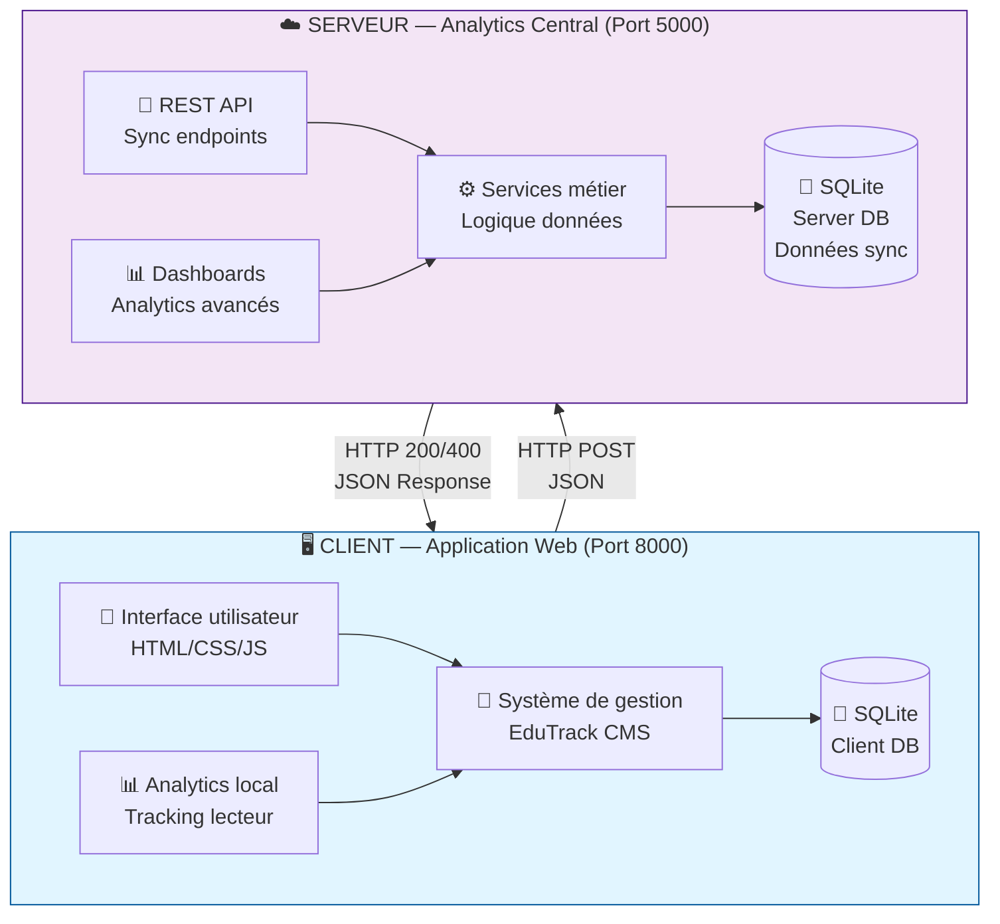
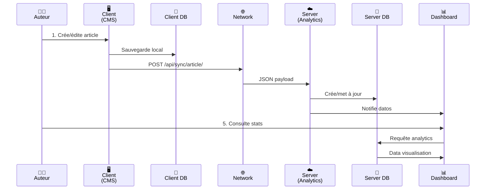
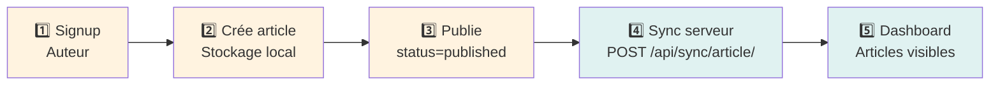
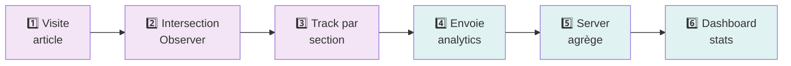

# 🎓 Digital Scholar — Présentation Globale du Système

> **Plateforme pédagogique intégrée** — Un système complet de publication, de suivi analytique et de gestion d'articles éducatifs pour enfants.

   

---

## 📑 Table des matières

1. [Aperçu visuel](#aperçu-visuel)
2. [Vue d'ensemble](#vue-densemble)
3. [Architecture globale](#architecture-globale)
4. [Composants du système](#composants-du-système)
5. [Stack technologique](#stack-technologique)
6. [Flux de données](#flux-de-données)
7. [Guide complet de navigation](#guide-complet-de-navigation)
8. [Guide de démarrage](#guide-de-démarrage)
9. [Support et documentation](#support-et-documentation)

---

## 🎨 Aperçu visuel

### Page d'accueil - Découverte d'articles

La page d'accueil affiche les articles publiés les plus récents avec une interface propre et intuitive :


---

### Lecture d'article - Expérience de lecture

Interface de lecture complète avec:
- Sections structurées (Introduction, Contenu, Conclusion, Ressources)
- Système de commentaires threaded
- Tracking automatique du temps de lecture par section
- Options de partage


---

### Exploration des articles - Catalogue avec filtres

Vue de tous les articles publiés avec:
- Filtrage par catégorie
- Recherche par titre/tags
- Statistiques par article (vues, commentaires)
- Navigation fluide


---

### Création/Édition d'article - Éditeur puissant

Formulaire complet pour créer et éditer des articles avec:
- Éditeur Rich-text (Quill.js)
- Gestion des médias (images, vidéos, audio)
- Prévisualisation en temps réel
- Structuration en sections pédagogiques


---

### Dashboard auteur - Statistiques personnalisées

Tableau de bord avec:
- Vue d'ensemble des articles (BROUILLON vs PUBLIÉS)
- Statistiques en temps réel (vues, commentaires, partages)
- Graphiques de tendances (Chart.js)
- Actions rapides (créer, éditer, supprimer)


---

## 🎯 Vue d'ensemble

**Digital Scholar** est une plateforme éducative complète composée de deux applications Django qui communiquent par API REST :

### Objectifs principaux

- ✅ Offrir une **alternative pédagogique à Substack** pour les enseignants
- ✅ Fournir un **CMS intuitif** pour la création et publication d'articles structurés
- ✅ Implémenter un **système d'analytics avancé** pour mesurer l'engagement
- ✅ Synchroniser les données en **temps quasi-réel** entre client et serveur
- ✅ Proposer des **dashboards intuitifs** avec visualisations de données
- ✅ Assurer la **sécurité et la conformité** des données éducatives

### Cas d'usage principaux

| Utilisateur | Tâches principales |
|---|---|
| 👨‍🏫 **Enseignant / Auteur** | Créer, publier, éditer articles • Visualiser statistiques • Répondre aux commentaires |
| 👧 **Enfant / Lecteur** | Découvrir articles • Lire et commenter • Interagir (partages) |
| 📊 **Administrateur / Analytique** | Exploiter les données • Générer rapports • Analyser tendances |

---

## 🏗️ Architecture globale

### Diagramme architecture haute niveau



### Flux de données entre Client et Serveur



---

## 🔌 Composants du système

### 1️⃣ CLIENT — Application de publication (Port 8000)

**Localisation:** [`Client_blog_post/`](Client_blog_post/)

**Responsabilités:**
- Interface de publication pour auteurs
- Éditeur d'articles structuré
- Visualisation et lecture d'articles par lecteurs
- Gestion des commentaires
- Tracking des interactions (analytics local)
- Synchronisation des données vers le serveur

**Caractéristiques principales:**

| Fonctionnalité | Description | Fichier |
|---|---|---|
| 📝 **CRUD Articles** | Create, Read, Update, Delete | [`blog/views.py`](Client_blog_post/blog/views.py) |
| 💬 **Commentaires threaded** | Réponses imbriquées | [`blog/models.py`](Client_blog_post/blog/models.py) |
| 🏷️ **Catégorisation** | 20 catégories + tags libres | [`blog/forms.py`](Client_blog_post/blog/forms.py) |
| 📊 **Analytics local** | Tracking sections, durée, device | [`blog/sync.py`](Client_blog_post/blog/sync.py) |
| 🔐 **Authentification** | Signup/Login auteurs | [`blog/views.py`](Client_blog_post/blog/views.py) |
| 🎨 **Interface responsive** | Mobile, tablet, desktop | [`Client_blog_post/templates/`](Client_blog_post/templates/) |
| 📱 **Suivi engagement** | Vues, partages, temps lecture | [`static/js/analytics.js`](Client_blog_post/static/js/analytics.js) |

**Documentation détaillée:** ➡️ Voir [Client_blog_post/README.md](Client_blog_post/README.md)

---

### 2️⃣ SERVEUR — Plateforme analytique (Port 5000)

**Localisation:** [`serveur/`](serveur/)

**Responsabilités:**
- Réception et validation des données synchronisées
- Agrégation et analyse des données analytiques
- Dashboards multidimensionnels
- Exploration et tendances
- Gestion des utilisateurs et auteurs

**Caractéristiques principales:**

| Fonctionnalité | Description | Fichier |
|---|---|---|
| 🔌 **9 Endpoints REST API** | Sync users, articles, analytics | [`analytics/api.py`](serveur/analytics/api.py) |
| 📊 **Dashboard global** | KPIs, tendances, top articles | [`analytics/views.py`](serveur/analytics/views.py) |
| 📈 **Analytique avancée** | Breakdown par section, device, auteur | [`analytics/services.py`](serveur/analytics/services.py) |
| 🔍 **Explorateur articles** | Filtrage, recherche, tri | [`analytics/views.py`](serveur/analytics/views.py) |
| 👥 **Gestion auteurs** | Stats, activité, articles | [`analytics/views.py`](serveur/analytics/views.py) |
| 📱 **Activité utilisateurs** | Sessions, devices, navigateurs | [`analytics/views.py`](serveur/analytics/views.py) |
| 💾 **Synchronisation atomique** | Backup et consistency | [`analytics/api.py`](serveur/analytics/api.py) |

**Documentation détaillée:** ➡️ Voir [serveur/README.md](serveur/README.md)

---

## 💻 Stack technologique

### Frontend

```
┌─────────────────────────────────────────┐
│  Couche présentation                    │
├─────────────────────────────────────────┤
│  • HTML5 + CSS3 (Grid, Flexbox)        │
│  • JavaScript Vanilla (ES6+)            │
│  • Intersection Observer API (tracking) │
│  • LocalStorage (caching)               │
│  • Fetch API (requêtes HTTP)            │
├─────────────────────────────────────────┤
│  Bibliothèques CDN                      │
│  • Quill.js 1.3.7 (éditeur rich-text)  │
│  • Chart.js 4.4.4 (graphiques)          │
│  • Google Fonts (Newsreader, Public)   │
└─────────────────────────────────────────┘
```

### Backend

```
┌─────────────────────────────────────────┐
│  Framework & ORM                        │
├─────────────────────────────────────────┤
│  • Django 6.0.3 (web framework)        │
│  • Django ORM (persistance données)     │
│  • SQLite 3 (base de données)           │
│  • Bleach 6.x (sanitisation HTML)       │
├─────────────────────────────────────────┤
│  Sécurité                               │
│  • Django Sessions (auth)               │
│  • CSRF Protection (middleware)         │
│  • Password hashing (PBKDF2)            │
│  • SQL injection prevention (ORM)       │
│  • XSS prevention (template escaping)   │
└─────────────────────────────────────────┘
```

### Infrastructure

```
┌─────────────────────────────────────────┐
│  Environnement de développement         │
├─────────────────────────────────────────┤
│  • Python 3.14+ (language)              │
│  • VS Code (IDE)                        │
│  • Virtual Environment (.venv)          │
│  • Git + GitHub (version control)       │
│  • PowerShell (terminal)                │
├─────────────────────────────────────────┤
│  Déploiement (recommandé)               │
│  • Gunicorn (WSGI server)               │
│  • Nginx (reverse proxy)                │
│  • PostgreSQL (production DB)           │
│  • Docker (containerisation)            │
└─────────────────────────────────────────┘
```

---

## 🔄 Flux de données

### 1. Flux auteur (Publication)



### 2. Flux lecteur (Engagement)



### 3. Flux synchronisation complète

```mermaid
graph TB
    Client["📱 Client<br/>Full state"]
    
    Client --> |POST /api/sync/full/| API["🔌 API<br/>Validation"]
    API --> |transaction()| DB["💾 Database<br/>Server"]
    
    subgraph Sync["Éléments synchronisés"]
        Users["Users"]
        Tags["Tags"]
        Articles["Articles"]
        Comments["Comments"]
        Analytics["Analytics Events"]
        Logs["Action Logs"]
    end
    
    API --> Sync
    Sync --> DB
    
    DB --> Response["200 OK<br/>{ok: true}"]
    
    style Client fill:#fff3e0
    style API fill:#e0f2f1
    style DB fill:#e0f2f1
    style Response fill:#c8e6c9
```

---

## 📚 Guide complet de navigation

### Structure du projet

```
PROJET N°3/
│
├── 📄 README.md                          ← Vue d'ensemble (CE FICHIER)
├── 📄 PRESENTATION.md                    ← Présentation complète
├── 📄 TEST_CASES_USER_STORIES.md         ← Cases de test détaillées
│
├── 🖥️  Client_blog_post/                 ← APPLICATION CLIENT
│   ├── README.md                         ← Documentation client
│   ├── manage.py
│   ├── db.sqlite3                        ← Base données locale
│   │
│   ├── blog/                             ← App principale
│   │   ├── models.py                     ← 7 modèles (User, Article, etc.)
│   │   ├── views.py                      ← 11 vues (CRUD, auth, tracking)
│   │   ├── forms.py                      ← Formulaires (ArticleForm, etc.)
│   │   ├── urls.py                       ← Routes
│   │   ├── sync.py                       ← Synchronisation vers serveur
│   │   ├── admin.py                      ← Django Admin
│   │   └── management/commands/
│   │       ├── full_sync.py              ← Bootstrap sync
│   │       └── seed_demo_data.py         ← Données de démo
│   │
│   ├── templates/blog/                   ← Pages (5 templates)
│   │   ├── home.html                     ← Page d'accueil
│   │   ├── article_list.html             ← Liste articles
│   │   ├── article_detail.html           ← Lecture + commentaires
│   │   ├── article_form.html             ← Éditeur
│   │   ├── dashboard.html                ← Dashboard auteur
│   │   └── ...
│   │
│   ├── static/
│   │   ├── css/                          ← Feuilles de styles (7 fichiers)
│   │   └── js/
│   │       └── analytics.js              ← Tracking Intersection Observer
│   │
│   └── Client_blog_post/                 ← Config Django
│       ├── settings.py                   ← Configuration
│       ├── urls.py                       ← Routes globales
│       └── wsgi.py                       ← WSGI entry
│
├── ☁️  serveur/                          ← APPLICATION SERVEUR
│   ├── README.md                         ← Documentation serveur
│   ├── manage.py
│   ├── db.sqlite3                        ← Base données analytics
│   │
│   ├── analytics/                        ← App analytique
│   │   ├── models.py                     ← 12 modèles (Client*, Teacher, etc.)
│   │   ├── views.py                      ← 9 vues (dashboards, pages)
│   │   ├── api.py                        ← 9 endpoints API REST
│   │   ├── services.py                   ← Logique analytique
│   │   ├── urls.py                       ← Routes
│   │   ├── admin.py                      ← Django Admin
│   │   └── management/commands/
│   │       └── seed_test_data.py         ← Données de test
│   │
│   ├── templates/analytics/              ← Pages dashboards
│   │   ├── api_docs.html                 ← Documentation API
│   │   ├── dashboard.html                ← Dashboard global
│   │   ├── explorateur.html              ← Explorateur articles
│   │   ├── tendances.html                ← Tendances
│   │   ├── article_detail.html           ← Analytics article
│   │   ├── auteur_detail.html            ← Analytics auteur
│   │   ├── utilisateurs.html             ← Activité utilisateurs
│   │   └── ...
│   │
│   ├── static/
│   │   ├── css/                          ← Styles dashboards
│   │   └── js/                           ← Scripts interactions
│   │
│   └── digital_scholar/                  ← Config Django
│       ├── settings.py
│       ├── urls.py
│       └── wsgi.py
│
└── 🎨  Design sans titre (1)/            ← Assets design (optionnel)
```

### Documentation par domaine

#### 🖥️ **Client (CMS) — Application Web**
- **Point d'entrée:** Voir [Client_blog_post/README.md](Client_blog_post/README.md)
- **Modèles de données:** [Client_blog_post/blog/models.py](Client_blog_post/blog/models.py)
- **Routes & Vues:** [Client_blog_post/blog/urls.py](Client_blog_post/blog/urls.py) + [Client_blog_post/blog/views.py](Client_blog_post/blog/views.py)
- **Formulaires:** [Client_blog_post/blog/forms.py](Client_blog_post/blog/forms.py)
- **Synchronisation:** [Client_blog_post/blog/sync.py](Client_blog_post/blog/sync.py)
- **Templates:** [Client_blog_post/templates/](Client_blog_post/templates/)
- **Styles:** [Client_blog_post/static/css/](Client_blog_post/static/css/)
- **Tracking:** [Client_blog_post/static/js/analytics.js](Client_blog_post/static/js/analytics.js)

#### ☁️ **Serveur (Analytics) — Plateforme analytique**
- **Point d'entrée:** Voir [serveur/README.md](serveur/README.md)
- **Modèles & Base de données:** [serveur/analytics/models.py](serveur/analytics/models.py)
- **API REST:** [serveur/analytics/api.py](serveur/analytics/api.py)
- **Vues & Pages:** [serveur/analytics/views.py](serveur/analytics/views.py)
- **Logique analytique:** [serveur/analytics/services.py](serveur/analytics/services.py)
- **Routes:** [serveur/analytics/urls.py](serveur/analytics/urls.py)
- **Dashboards:** [serveur/templates/analytics/](serveur/templates/analytics/)

#### 🧪 **Tests & QA**
- **User Stories & Test Cases:** Voir [TEST_CASES_USER_STORIES.md](TEST_CASES_USER_STORIES.md)
- **Tests Client:** [Client_blog_post/blog/tests.py](Client_blog_post/blog/tests.py)
- **Tests Serveur:** [serveur/analytics/tests.py](serveur/analytics/tests.py)

---

## 🚀 Guide de démarrage

### Prérequis

- Python 3.14+
- pip (gestionnaire de paquets)
- Git
- VS Code ou IDE similaire

### Installation complète

#### 1. Cloner et préparer

```bash
# Cloner le projet (si sur GitHub)
git clone <repo-url>
cd "PROJET N°3"

# Créer environnement virtuel
python -m venv .venv

# Activer l'environnement
.venv\Scripts\activate        # Windows
source .venv/bin/activate     # macOS/Linux
```

#### 2. Démarrer le SERVEUR

```bash
# Naviguer au dossier serveur
cd serveur

# Appliquer migrations
python manage.py migrate

# (Optionnel) Charger données de test
python manage.py seed_test_data

# Démarrer serveur
python manage.py runserver 5000
# Accédez à http://localhost:5000/
```

#### 3. Démarrer le CLIENT

```bash
# Ouvrir nouveau terminal, activer .venv

# Naviguer au dossier client
cd Client_blog_post

# Appliquer migrations
python manage.py migrate

# (Optionnel) Charger données de démo
python manage.py seed_demo_data

# Démarrer client
python manage.py runserver 8000
# Accédez à http://localhost:8000/
```

### Accès et Premières étapes

| Composant | URL | Rôle |
|---|---|---|
| **Home Client** | http://localhost:8000/ | Page d'accueil, articles publiés |
| **Signup Client** | http://localhost:8000/accounts/signup/ | Créer compte auteur |
| **Dashboard Auteur** | http://localhost:8000/dashboard/ | Statistiques auteur |
| **API Docs Serveur** | http://localhost:5000/ | Documentation API |
| **Dashboard Admin** | http://localhost:5000/dashboard/ | Analytics globale |
| **Explorateur** | http://localhost:5000/explorateur/ | Explorer tous les articles |
| **Django Admin Client** | http://localhost:8000/admin/ | Gestion base données client |
| **Django Admin Serveur** | http://localhost:5000/admin/ | Gestion base données serveur |

### Credentials de démo (si données chargées)

```
Username: demo_author
Password: DemoPass123!
Email: demo@example.com
```

---

## 📖 Support et documentation

### Fichiers de documentation

| Fichier | Contenu | Audience |
|---|---|---|
| **README.md** | Vue d'ensemble projet | Tous |
| **PRESENTATION.md** | Présentation détaillée + architecture | Développeurs, PMs |
| **Client_blog_post/README.md** | Spécifications client | Dev Frontend/Backend Client |
| **serveur/README.md** | Spécifications serveur | Dev Backend Serveur |
| **TEST_CASES_USER_STORIES.md** | 40 User Stories + tests | QA, Test Engineers |

### Guides techniques par sujet

#### 📝 Si vous travaillez sur... **Création/Edition d'articles**
→ Voir [Client_blog_post/blog/models.py](Client_blog_post/blog/models.py) + [Client_blog_post/blog/forms.py](Client_blog_post/blog/forms.py) + [Client_blog_post/blog/views.py (article_create/edit)](Client_blog_post/blog/views.py)

#### 📊 Si vous travaillez sur... **Analytics et dashboards**
→ Voir [serveur/analytics/services.py](serveur/analytics/services.py) + [serveur/analytics/views.py](serveur/analytics/views.py) + [serveur/templates/analytics/](serveur/templates/analytics/)

#### 🔌 Si vous travaillez sur... **Synchronisation Client↔Server**
→ Voir [Client_blog_post/blog/sync.py](Client_blog_post/blog/sync.py) + [serveur/analytics/api.py](serveur/analytics/api.py)

#### 🔐 Si vous travaillez sur... **Authentification & Sécurité**
→ Voir [Client_blog_post/blog/views.py (signup/login)](Client_blog_post/blog/views.py) + [Client_blog_post/blog/forms.py (AuthorSignupForm)](Client_blog_post/blog/forms.py)

#### 💬 Si vous travaillez sur... **Commentaires & Engagement**
→ Voir [Client_blog_post/blog/models.py (ReaderComment)](Client_blog_post/blog/models.py) + [Client_blog_post/blog/views.py (commentaire)](#) + [Client_blog_post/templates/blog/comment_node.html](Client_blog_post/templates/blog/comment_node.html)

#### 📱 Si vous travaillez sur... **Responsive Design**
→ Voir [Client_blog_post/static/css/](Client_blog_post/static/css/) + [Client_blog_post/templates/](Client_blog_post/templates/)

---

## 🎯 Fonctionnalités principales par application

### Application CLIENT

✅ Authentification auteurs (Signup/Login/Logout)
✅ CRUD articles structurés (20 catégories + tags)
✅ Éditeur Rich-text (Quill.js)
✅ Système de commentaires threaded
✅ Tracking analytics (Intersection Observer)
✅ Dashboard auteur avec 8 graphiques
✅ Recherche intelligente d'articles
✅ Partage avec compteur
✅ Support multimédia (images, vidéos, audio)
✅ Responsive design (mobile-first)
✅ Protection CSRF
✅ HTML sanitisation (bleach)

### Application SERVEUR

✅ 9 endpoints API REST de synchronisation
✅ Dashboard analytique global
✅ Explorateur d'articles avec filtrage/recherche
✅ Analyse des tendances
✅ Détails analytiques par article
✅ Détails analytiques par auteur
✅ Suivi activité utilisateurs
✅ Breakdown par device/navigateur/OS
✅ Graphiques avec Chart.js
✅ Synchronisation atomique
✅ Backward-compatibility (API legacy)
✅ Django Admin pour gestion

---

## 🔗 Ressources externes

### Documentations oficiales
- [Django Documentation](https://docs.djangoproject.com/)
- [Quill.js Documentation](https://quilljs.com/)
- [Chart.js Documentation](https://www.chartjs.org/)
- [Bleach Documentation](https://bleach.readthedocs.io/)
- [SQLite Documentation](https://www.sqlite.org/docs.html)

### Références d'architecture
- [REST API Best Practices](https://www.restapitutorial.com/)
- [Django ORM Patterns](https://docs.djangoproject.com/en/6.0/topics/db/models/)
- [Web Security Standards - OWASP](https://owasp.org/www-project-top-ten/)

---

## 📊 Statistiques du projet

| Métrique | Valeur |
|---|---|
| **Applications Django** | 2 (Client + Serveur) |
| **Modèles de données** | 19 au total (7 Client + 12 Serveur) |
| **Vues** | 20+ (11 Client + 9+ Serveur) |
| **Endpoints API** | 9 (+ 2 legacy) |
| **Templates** | 15+ |
| **Feuilles CSS** | 7 |
| **Catégories article** | 20 prédéfinies |
| **Langues supportées** | Français (100%) |
| **Responsive breakpoints** | 3 (mobile, tablet, desktop) |

---

## 👥 Équipe et contacts

- **Développement:** Développeur Full-Stack
- **Architecture:** Architecte Système
- **Tests & QA:** Test Engineer
- **Produit:** Product Manager

---

## 📄 Changelog

### Version 1.0 (Actuelle)
- ✅ Système complet Client/Serveur
- ✅ 40+ User Stories
- ✅ API REST synchronisation
- ✅ Dashboards analytiques
- ✅ Tests de sécurité basiques

### Prochaines versions
- 🔄 Authentification OAuth2
- 🔄 Notifications push
- 🔄 Export PDF articles
- 🔄 Mode collaboration temps-réel
- 🔄 Multi-langue (anglais, espagnol)
- 🔄 Containerisation Docker
- 🔄 CI/CD Pipeline

---

## 📝 Notes importantes

### ⚠️ Développement local
- Utiliser `.venv` pour l'environnement virtuel
- Les bases SQLite sont des fichiers locaux (`.git` ignore)
- DEBUG=True en développement (à mettre False en prod)
- Clés secrètes à régénérer pour production

### 🔒 Sécurité en production
- [ ] Mettre SECRET_KEY à l'aide de variables d'environnement
- [ ] DEBUG = False
- [ ] ALLOWED_HOSTS configuré correctement
- [ ] HTTPS forcé (SECURE_SSL_REDIRECT = True)
- [ ] Cookies HTTPONLY et SECURE
- [ ] CORS configuré (si API publique)
- [ ] Rate limiting implémenté
- [ ] Audit logging actif

### 📦 Déploiement recommandé
- PostgreSQL pour la base (production)
- Gunicorn + Nginx (serveur web)
- Redis (caching)
- Docker pour la conteneurisation
- GitHub Actions pour CI/CD

---

**Dernière mise à jour:** 14 Avril 2026
**Version:** 1.0.0
**Statut:** En développement actif
**Licence:** MIT

---

### 📌 Navigation rapide
- [🖥️ Aller au code Client](Client_blog_post/)
- [☁️ Aller au code Serveur](serveur/)
- [🧪 Voir les Test Cases](TEST_CASES_USER_STORIES.md)
- [📄 Retour au README principal](README.md)
